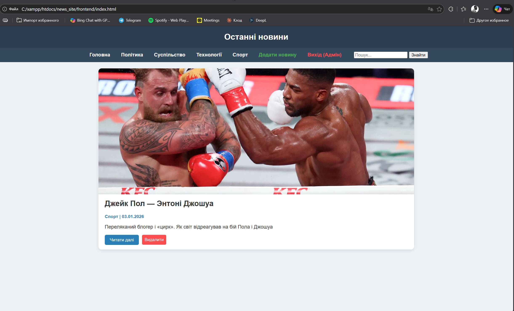
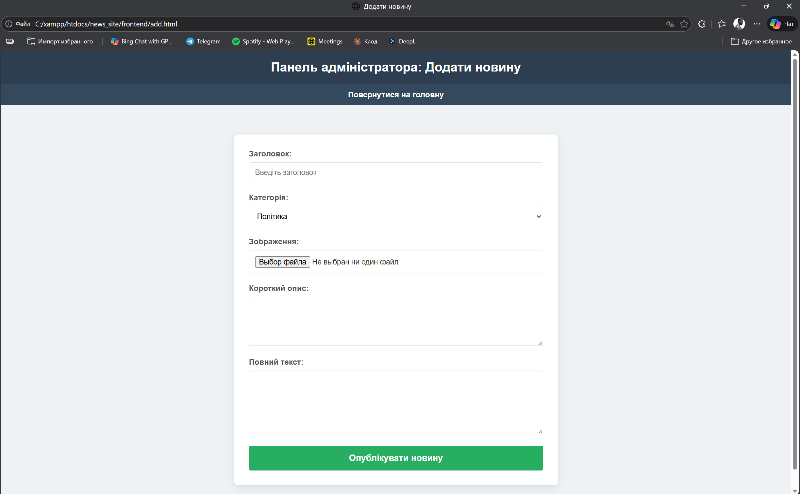
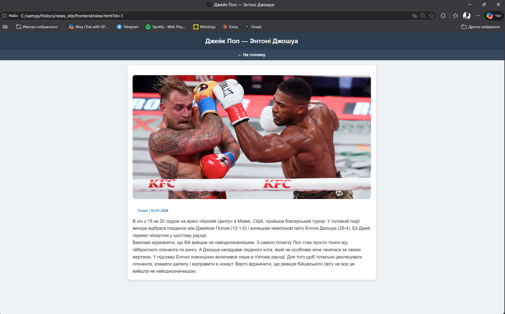
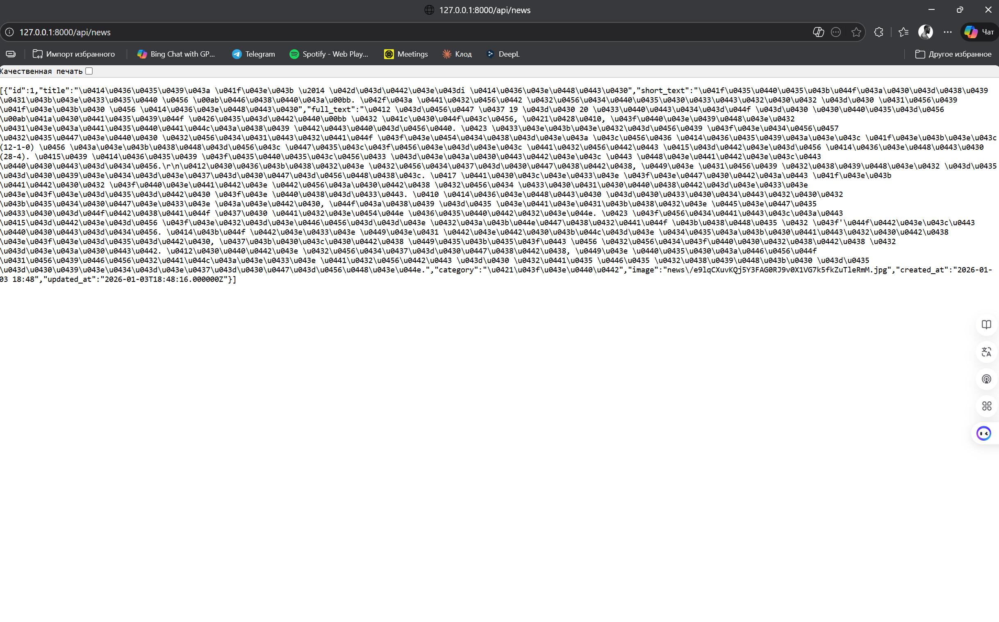

#Інформаційний веб-сайт новин (Laravel + JS API)
##Курсова робота студента групи ЗАІ-221 Арнаутова Д.В.

🛠 ##Залежності (Dependencies)

Для роботи проекту необхідно встановити:

PHP: 8.2 або вище

Composer: для керування пакетами Laravel

MySQL: сервер бази даних (рекомендується XAMPP)

Web Server: вбудований сервер Artisan або Apache

⚙️ ##Встановлення та запуск (Startup)

###Клонуйте репозиторій та перейдіть у папку backend.

###Встановіть залежності:
```bash
composer install
```
###Налаштуйте середовище:
```bash
cp .env.example .env
php artisan key:generate
```
###Створіть БД та виконайте міграції: Відредагуйте .env, вказавши назву вашої бази даних, і запустіть:

```bash
php artisan migrate
```
###Створіть посилання для зображень:

```bash
php artisan storage:link
```
###Запустіть сервер:
```bash
php artisan serve
```

👤 ##Тестові логіни та Seed
Оскільки система передбачає вхід лише для адміністратора, виконайте наступну команду для створення тестового акаунта (Seeding через Tinker):
```bash
php artisan tinker
### У консолі введіть:
$user = \App\Models\User::create(['login'=>'admin', 'password'=>bcrypt('12345')]);
```

###Логін: admin

###Пароль: 12345

🖼 ##Скріншоти (Screenshots)







